# Table of Contents

- [Table of Contents](#table-of-contents)
- [Building Management System](#building-management-system)
- [Video example](#video-example)
- [Hardware setup](#hardware-setup)
  - [Esp & Current sensor](#esp--current-sensor)
  - [Esp & Dht sensor](#esp--dht-sensor)
  - [Esp & Motion sensor](#esp--motion-sensor)
  - [Esp & Relay](#esp--relay)
- [Installation](#installation)
  - [Esp](#esp)
  - [Raspberry Pi](#raspberry-pi)
  - [Server](#server)
  - [Client](#client)
- [Usage](#usage)
  - [Raspberry Pi](#raspberry-pi-1)
  - [Website (server and client)](#website-server-and-client)
- [Contributing](#contributing)
- [License](#license)

# Building Management System

This project seeks to demonstrate the use of MQTT protocol and MERN stack for building an IoT Building Management System for commercial usage, where parameters such as building occupancy, energy demand, andenergy consumption are measured and displayed on an online database and dashboard.

A more detailed description of the project can be found [here](https://github.com/peterokwara/BuildingManagement/blob/master/Project%20Report.pdf).

# Video example

A video of the project working

<a href="https://www.youtube.com/watch?v=Yh3uR8R79lM" target="_blank"><p align="center">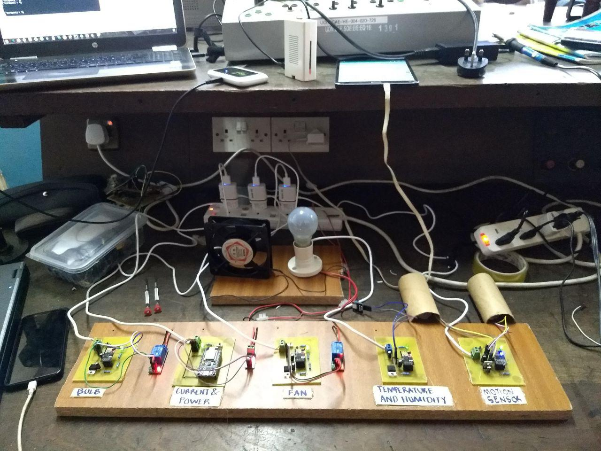</p></a>

# Hardware setup

## Esp & Current sensor

Circuit design

<p  align="center">
  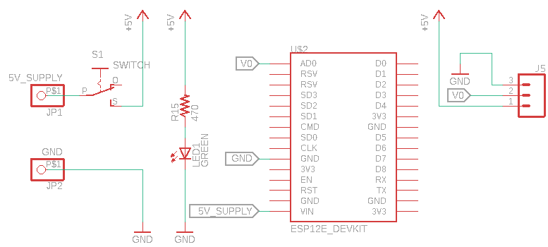
</p>

Board design and the final look

<p align="center">
  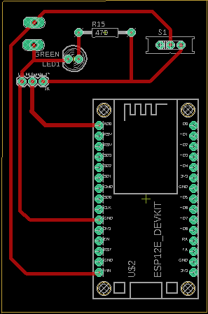
   
</p>

## Esp & Dht sensor

Circuit design

<p align="center">
  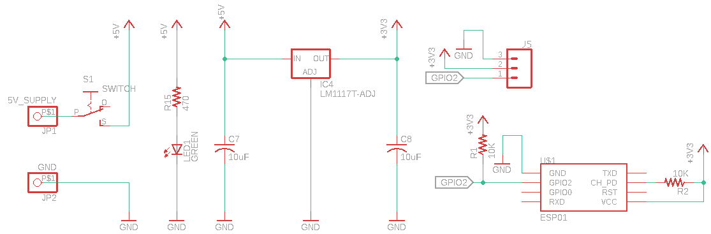
</p>

Board design and the final look

<p align="center">
  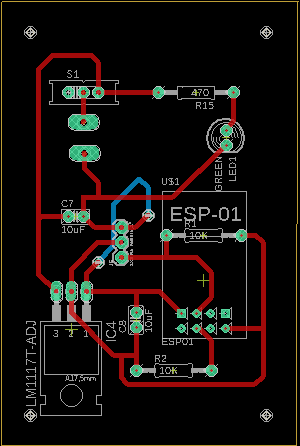
  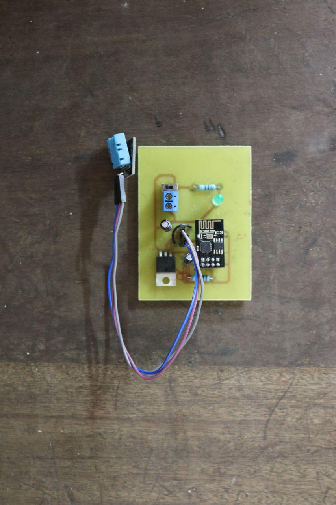 
</p>

## Esp & Motion sensor

Circuit design

<p align="center">
  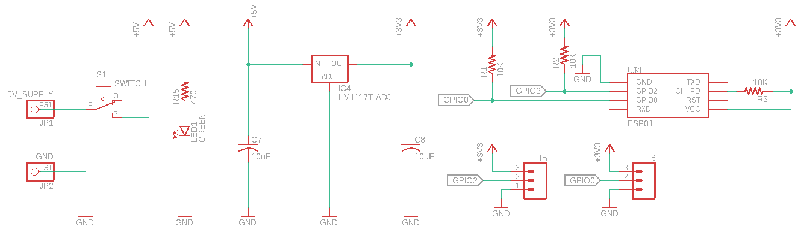
</p>

Board design and the final look

<p align="center">
  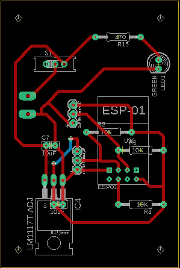
  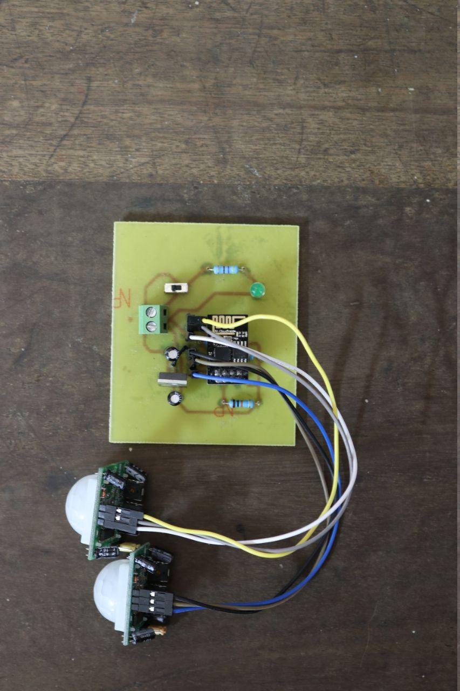 
</p>

## Esp & Relay

Circuit design

<p align="center">
  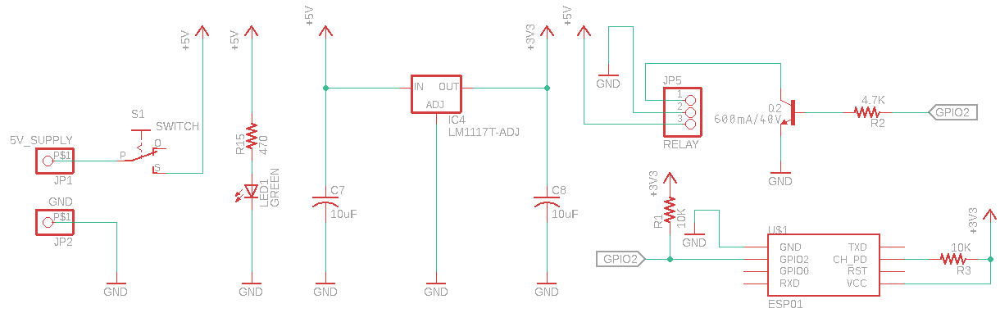
</p>

Board design and the final look

<p align="center">
  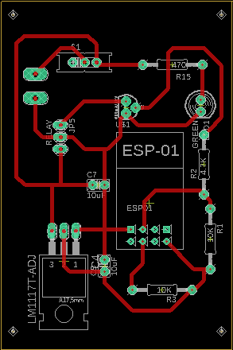
  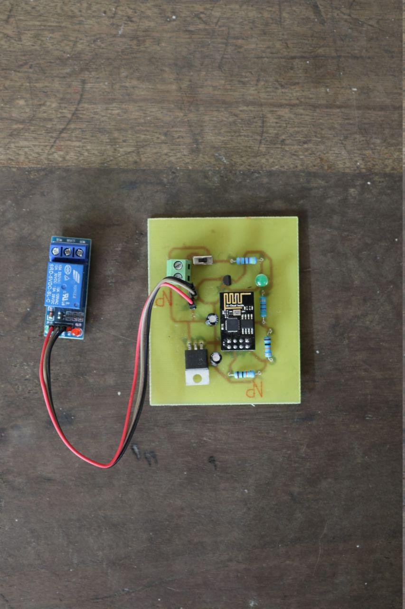 
</p>

# Installation

## Esp

Installing in an ESP8266-01 and NodeMCU involves pushing the python files into the device whether it's via a usb to ttl or just a usb cable. This can be done using the command

```bash
sudo ampy --port /dev/ttyUSB0 --baud 115200 put main.py
sudo ampy --port /dev/ttyUSB0 --baud 115200 put config.py
sudo ampy --port /dev/ttyUSB0 --baud 115200 put connectWifi.py
```

You need to create a config.py file with the following information for each and every esp folder (current-sensor, dht-sensor, motion-sensor, relay-bulb, relay-fan)

```python
MQTT_CONFIG = {
    'SENSOR_ID': '',
    'MQTT_HOST': '',
    'PORT': '',
    'PUB_TOPIC': ''
}

WIFI_CONFIG = {
    'WIFI_ESSID': '',
    'WIFI_PASSWORD': ''
}
```

## Raspberry Pi

To install npm packages used for the Raspberry Pi, you run.

```bash
npm install axios mongoose mqtt
```

You also need to create a config folder and have two files that contain config/broker.js

```js
module.exports = {
  brokerUrl: ""
};
```

and config/server.js

```js
module.exports = {
  serverUrl: ""
};
```

## Server

To install npm packages used for the server, you run.

```bash
npm install axios bcryptjs body-parser concurrently cors express gravatar jsonwebtoken mongoose mqtt passport passport-jwt recharts validator
```

You also need to have a config/keys_dev.js with the configuration above. The mongoUri and secretOrKey are obtained when you create a mongodb on https://mlab.com the database I used.

```js
module.exports = {
  mongoUri: "",
  secretOrKey: ""
};
```

## Client

To install npm packages used for the client, you run.

```bash
npm install jwt-decode axios react-redux redux recharts redux-thunk semantic-ui-css semantic-ui-react
```

# Usage

## Raspberry Pi

To run the code for Raspberry Pi just cd into the folder and run

```bash
node app.js
```

To ensure that the Raspberry Pi runs the code whenever it boots, edit the rc.local file

```
sudo nano /etc/rc.local
```

and add

```
node app.js &
```

## Website (server and client)

To run a local development of the website, all you need to do is to do the installation setup then once that is done

```
cd site && npm run dev
```

# Contributing

Pull requests are welcome. For major changes, please open an issue first to discuss what you would like to change.

Please make sure to update tests as appropriate.

# License

[MIT](https://github.com/peterokwara/BuildingManagement/blob/master/LICENSE)
